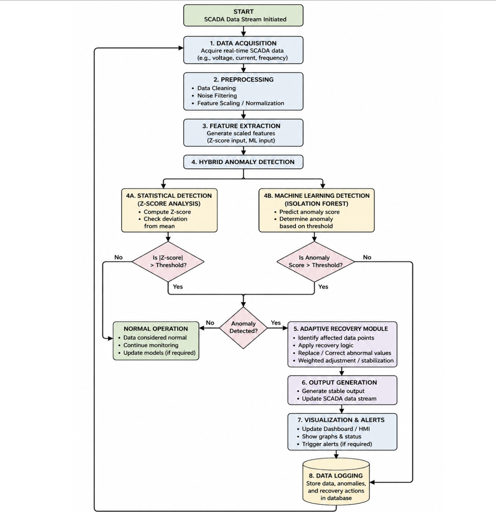
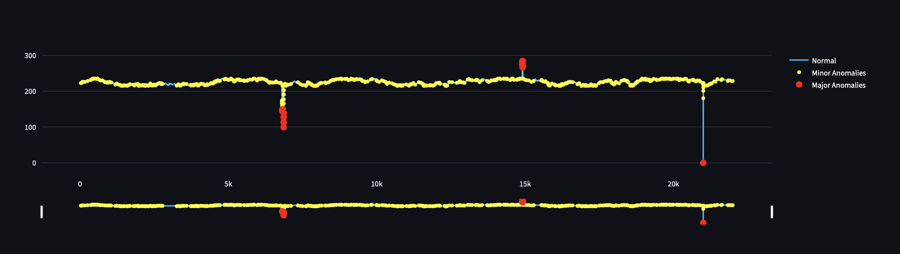
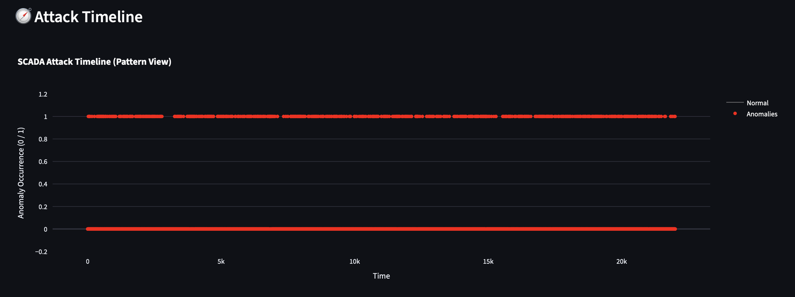
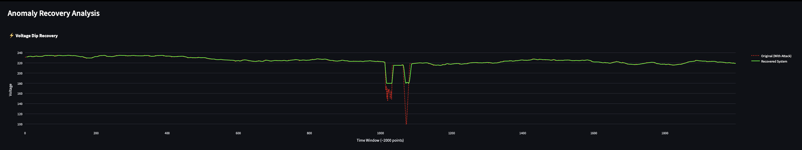
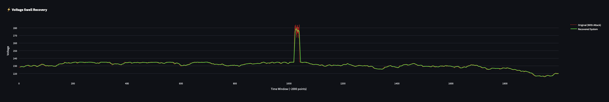
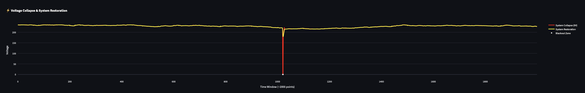

# Hybrid SCADA Anomaly Detection and Adaptive Recovery System

[](https://www.python.org/)


---

## Overview

This project presents a hybrid framework for anomaly detection, threat analysis, and recovery assessment in Supervisory Control and Data Acquisition (SCADA) systems.

The framework combines machine learning and statistical techniques to identify abnormal operating conditions and provide additional insights through threat classification, pattern analysis, risk assessment, and recovery evaluation.

The system was developed using Python and Streamlit and provides interactive visualizations for monitoring voltage-related disturbances in SCADA environments.

---

## System Architecture

<p align="center">

</p>

---

## Key Features

- Hybrid anomaly detection using Isolation Forest and Z-score validation.
- Detection of voltage dip, voltage swell, and voltage collapse events.
- Major and minor anomaly classification.
- Threat classification and pattern analysis.
- Attack timeline visualization.
- Risk assessment and response analysis.
- Recovery evaluation and signal restoration.
- Interactive dashboard using Streamlit and Plotly.
- PDF report generation.
- Sliding window based SCADA simulation.

---

## Technologies Used

### Programming Language

- Python

### Machine Learning

- Isolation Forest
- Z-score Statistical Validation

### Libraries

- Streamlit
- Plotly
- Pandas
- NumPy
- Scikit-learn
- Matplotlib
- ReportLab

---

## Project Workflow

```text
SCADA Dataset
      │
      ▼
Data Acquisition & Preprocessing
      │
      ▼
Hybrid Anomaly Detection
(Isolation Forest + Z-Score)
      │
      ▼
Threat Classification
      │
      ▼
Pattern Analysis
      │
      ▼
Risk Assessment & Response
      │
      ▼
Recovery Analysis
      │
      ▼
Dashboard & Report Generation
```

---

## Dataset

The framework was evaluated using a SCADA operational dataset containing **22,000 observations**.

The experiments focused on three disturbance conditions:

- Voltage Dip
- Voltage Swell
- Voltage Collapse

Although testing was performed on 22,000 samples, the framework can be extended to larger datasets.

---

# Dashboard Screenshots

<!-- ## Dashboard Overview

<p align="center">

</p>

--- -->

## Anomaly Detection

<p align="center">

</p>

The framework identifies both minor and major anomalies and highlights abnormal operating conditions.

---

## Attack Timeline Analysis

<p align="center">

</p>

This module provides a temporal view of anomaly occurrence across the monitoring period.

---

## Voltage Dip Recovery

<p align="center">

</p>

Comparison between the original disturbed signal and the recovered signal after a voltage dip event.

---

## Voltage Swell Recovery

<p align="center">

</p>

Recovery analysis for overvoltage conditions.

---

## Voltage Collapse and System Restoration

<p align="center">

</p>

Recovery behavior following a complete voltage collapse.

---

## Installation

Clone the repository:

```bash
git clone https://github.com/your-username/hybrid-scada-anomaly-detection-and-adaptive-recovery-system.git
```

Move to the project directory:

```bash
cd hybrid-scada-anomaly-detection-and-adaptive-recovery-system
```

Install dependencies:

```bash
pip install -r requirements.txt
```

Run the application:

```bash
streamlit run app.py
```

---

## Applications

- Industrial Control Systems (ICS)
- Smart Grid Monitoring
- Power System Security
- Critical Infrastructure Protection
- Cyber-Physical Systems
- SCADA Security Research

---

## Future Work

- Real-time SCADA data acquisition.
- ESP32-based hardware integration.
- Larger dataset evaluation.
- Explainable AI techniques.
- Advanced adaptive recovery strategies.

<!-- --- -->

<!-- ## Author

**Aditya Gupta**

B.Tech Electrical and Electronics Engineering

Maharaja Agrasen Institute of Technology, New Delhi -->

---

## License

This project is intended for academic and research purposes.